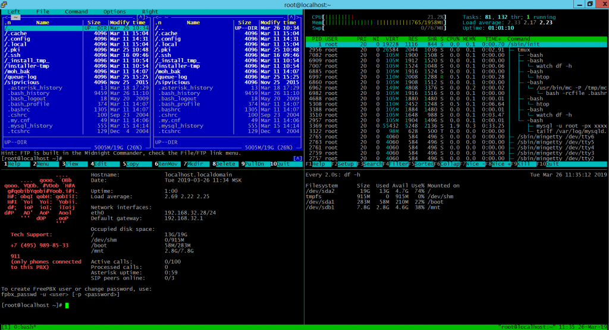
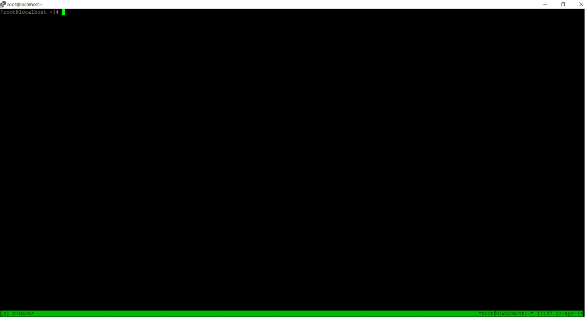
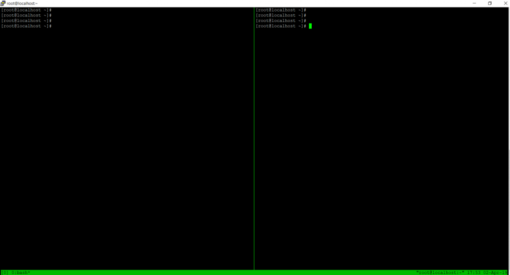
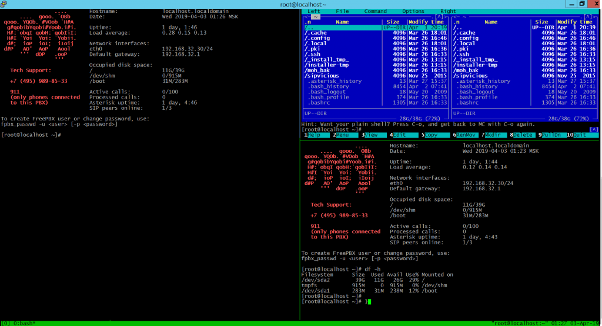
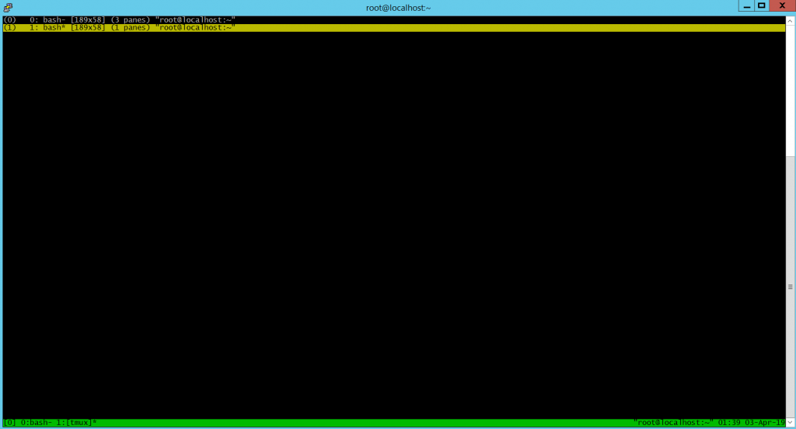

# Tmux – терминальный мультиплексор

Tmux  — это консольная утилита, предоставляющая пользователю доступ к нескольким терминалам в рамках одного экрана. Простыми словами, используя эту утилиту можно в одном окне открыть несколько терминальных окон. Также возможно подключение к существующей сессии из другого рабочего места не прерывая выполнение определенных задач. 




Как видно из скриншота, у нас несколько консольных панелей в одном окне. Очень удобно работать.
Приступим к более подробному рассмотрению.
Для установки tmux утилиты в операционной системе Centos достаточно выполнить команду:
```bash
yum install tmux
```

После установки программы можно приступать к использованию.

Вводим команду:

```bash
tmux
```

или
```bash
tmux new
```

Создается новая сессия, в которой будем дальше работать.
Понять, что мы находимся в tmux можно по наличию зеленой строки внизу консоли, на которой размещены дата и время.



По умолчанию создается одна панель на весь экран. Для того, чтобы добавить вертикальную панель необходимо воспользоваться сервисными клавишами «Ctrl+B»(система понимает, что вы вводите не консольную команду,  а пользуетесь функцией терминального мультиплексера), далее нажимаете «Shift+%». Справа создается еще одна панель.




Теперь в рамках одного окна у вас есть две рабочие зоны.

Для переключения между панелями воспользуйтесь клавишами «Ctrl+B» далее стрелочками вправо или влево.

Для создания горизонтальной панели нажмите «Crtl+B» далее «Shift+”» (кавычка находится на русской букве «Э»).




Для изменения размера определенной панели есть следующая комбинация клавиш:
«Ctrl+B», затем зажимаем Alt и стрелочками изменяем размер.


Для изменения местоположения панели воспользуется комбинацией клавиш «Ctrl+B» затем «}».


Также есть возможность создать еще одно окно. Для этого предусмотрена команда «Ctrl+B» «c».

Для просмотра списка окон можно воспользоваться командой «Ctrl+B» «w».



Как видно из скриншота, у нас создалось второе окно. Для удобного распознавания нужного окна можно присвоить им имена:

```bash
tmux rename-window masinc
```

Также можно воспользоваться командной строкой терминала выполнив команду «Ctrl+B» «:».

И в командной строке набрать команду «remane-window masinc» (где «masinc» это новое имя).

Для переименования сессии применяется следующая команда:

```bash
tmux rename-session –t 0 masinc
```

``-t`` указывает на номер сессии, если этот параметр опустить будет переименована существующая сессия.

Для просмотра количества существующих сессий воспользуемся командой
```bash
tmux ls
```
Создадим еще одну сессию tmux, для этого выйдем из существующей сессии:

```bash
tmux detach # (или Ctrl+B d)
tmux
```

Посмотрим список созданных сессий:

```bash
tmux ls
```


Для подключения к определенной сессий воспользуемся командой:

```bash
tmux a –t masinc
```

Мы подключились к сесси «masinc».

Для закрытия сессии необходимо закрыть все панели командой «Ctrl+B» «x». Затем «у» для подтверждения.

Также для завершения сессии можно воспользоваться командой:

```bash
tmux kill-session
```

Для отключения от сессии с сохранением ее работоспособности есть несколько вариантов:

```bash
tmux detach
```

или

```bash
tmux d
```

или «Ctrl+B» «d».

Также есть возможность управлять размером окон с помощью мышки. Для этого в конфигурационный файл /etc/tmux.conf
следует добавить следующие строки:

```
set -g mouse-resize-pane on
```

Для применения настроек необходимо перечитать конфигурационный файл
```bash
tmux source-file /etc/tmux.conf
```
Если вы хотите переподключиться к другой сессии выполните команду:

```bash
Tmux switch –t [name]
```
где name - имя сессии.

Для прокрутки страницы вверх используйте комбинацию клавиш «Ctrl+B» «PgUp/PgDwn»

Также очень много удобных дополнительных функций можно добавить внеся необходимые изменения в конфигурационный файл.
Воспользовавшить мануалом, можно получить дополнительную информацию:

```bash
man tmux
```

